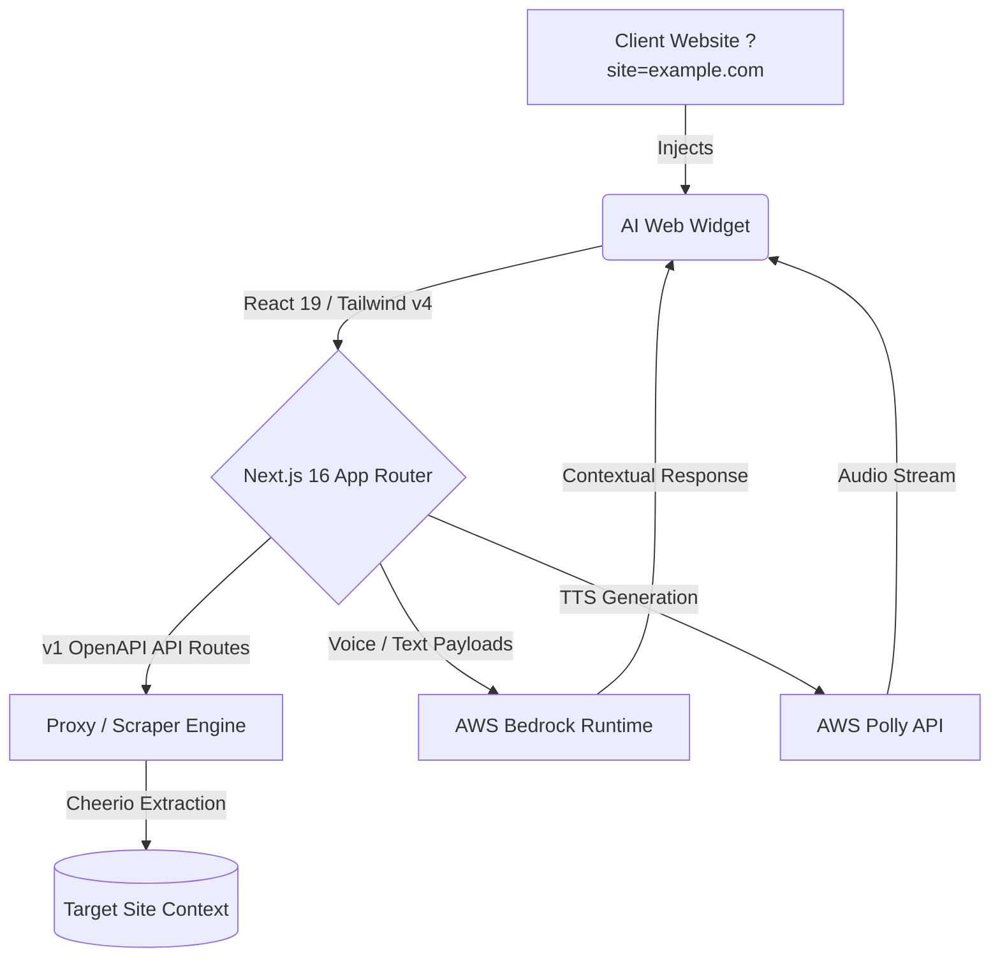

# 🚀 AI Booking Gateway & Widget Injector

> An advanced, embeddable widget system featuring AI-driven voice and chat assistants. Designed for seamless integration, dynamic personalization, and high-conversion lead generation, powered by Next.js, AWS Bedrock, and AWS Polly.

<div align="center">
  
[](https://nextjs.org/)
[](https://react.dev/)
[](https://tailwindcss.com/)
[](https://aws.amazon.com/)
[](https://www.typescriptlang.org/)
[](https://vitest.dev/)

</div>

---

## 🌟 Overview

The **AI Booking Gateway** (internal codename: `widget-inyector`) is a state-of-the-art front-end application and embeddable widget solution. It provides websites with instant AI capabilities, including interactive voice-enabled assistants, intelligent chat interfaces, and automated data extraction for contextualized lead generation. 

Whether it's parsing a target website to contextually understand a business, or providing an immersive iOS-style voice demo, this system is built to maximize user conversion and operational efficiency.

---

## 🏆 Project Milestones & Core Features

We have recently implemented a massive suite of features focusing on conversion, realism, and robust architecture:

### 🎙️ Advanced Voice Assistant & TTS Pipeline
- **Authentic iOS-Style UI:** A premium, familiar phone widget interface with a refined Push-to-Talk (PTT) demo flow.
- **Real Amazon Polly API Integration:** Seamless Text-to-Speech (TTS) pipeline linking the Voice UI to a robust Bedrock/Polly serverless backend endpoint.
- **Prosody Optimization:** Fine-tuned AWS Polly speech synthesis (including the "Marcos" voice) for a highly natural, conversational cadence.
- **Interactive Demo Flow:** Multi-step voice demonstration with interactive tap-chips to guide users effortlessly through the conversion funnel.
- **Responsive & Seamless:** Widget resize updates for mobile and precise position alignment to avoid overlaps with existing site elements.

### 📅 Calendar & Booking Integration
- **Embedded AI Calendar:** Fully migrated the Voice Agent booking flow into an immersive, React-based inline calendar, dramatically reducing booking friction directly within the widget.

### 🧠 Dynamic Personalization & Scraping
- **Contextual Scraping:** Implemented dynamic target website scanning (`?site` URL parsing) to provide highly personalized AI greetings based on the host page.
- **Niche Configuration Engine:** Expanded `nicheConfig` to definitively cover 7 specific industry sectors (Dental, Legal, SaaS, Auto, etc.), automatically customizing the AI's behavior and terminology.
- **Resilient Fallbacks:** Hardened scraping proxies with generic aesthetic fallbacks to guarantee perfect presentation and completely prevent AI hallucination when target data is unavailable or restrictive.

### ⚙️ Engine & Dashboard Upgrades
- **API Standardization:** Migrated all proxy and scraper endpoints to strict **v1 OpenAPI standards**.
- **Dashboard Enhancements:** Upgraded the injector panel to dynamically serve complete voice agent payloads instead of legacy static lead magnets.
- **Chat UX Polish:** Removed slow connecting animations to improve immediate conversion rates and resolved render loop issues for flawless long-session stability.

---

## 🏗️ Technical Architecture

This project strictly adheres to **Clean Architecture / Domain-Driven Design (DDD)** principles, structured to guarantee maximum enterprise scalability.

### 📡 System Flow Diagram



### 📁 Directory Structure (DDD)

```text
src/
├── app/                  # Next.js App Router & API Endpoints (v1)
├── application/          # Use cases and application logic
├── domain/               # Enterprise domain entities and interfaces
├── infrastructure/       # External integrations (AWS, Scrapers, Proxies)
└── presentation/         # React Components, UI, Hooks, and Configs
    ├── components/       # Reusable UI widgets (Voice, Chat, Calendar)
    └── config/           # Configurations like nicheConfig.ts
```

### 🛠️ Tech Stack Details
- **Framework:** Next.js 16.2 (App Router) with Turbopack for hybrid SSR/SSG and serverless API routes.
- **Language:** TypeScript `v5` ensuring absolute type safety across all domains.
- **Styling & UI:** Tailwind CSS v4, Framer Motion for fluid edge-to-edge animations, and customizable `lucide-react` icons.
- **Testing:** Comprehensive Vite-powered test environment (`vitest`, `jsdom`, `@testing-library/react`).

---

## 🚀 Getting Started

### Prerequisites

- Node.js 20+
- `npm`, `yarn`, or `pnpm`
- AWS Credentials configured in your environment for Bedrock and Polly access (IAM user with appropriate access).

### Installation & Run

1. **Clone & Install:**
   ```bash
   git clone git@github.com:Franklin-Osede/ai-booking-gateway.git
   cd widget-inyector
   npm install
   ```

2. **Environment Variables:**
   Duplicate the `.env.local.example` to `.env.local` and populate your AWS configurations:
   ```env
   AWS_REGION=us-east-1
   AWS_ACCESS_KEY_ID=your_access_key
   AWS_SECRET_ACCESS_KEY=your_secret_key
   ```

3. **Development Server:**
   Start the Turbopack-enabled development server:
   ```bash
   npm run dev
   ```
   *Application will be available at [`http://localhost:3005`](http://localhost:3005)*

---

## 🧪 Testing

Run the automated Vitest suite to validate domain logic and UI components:
```bash
npx vitest
```

---

<div align="center">
  <i>Designed and developed with modern web engineering standards.</i>
</div>
